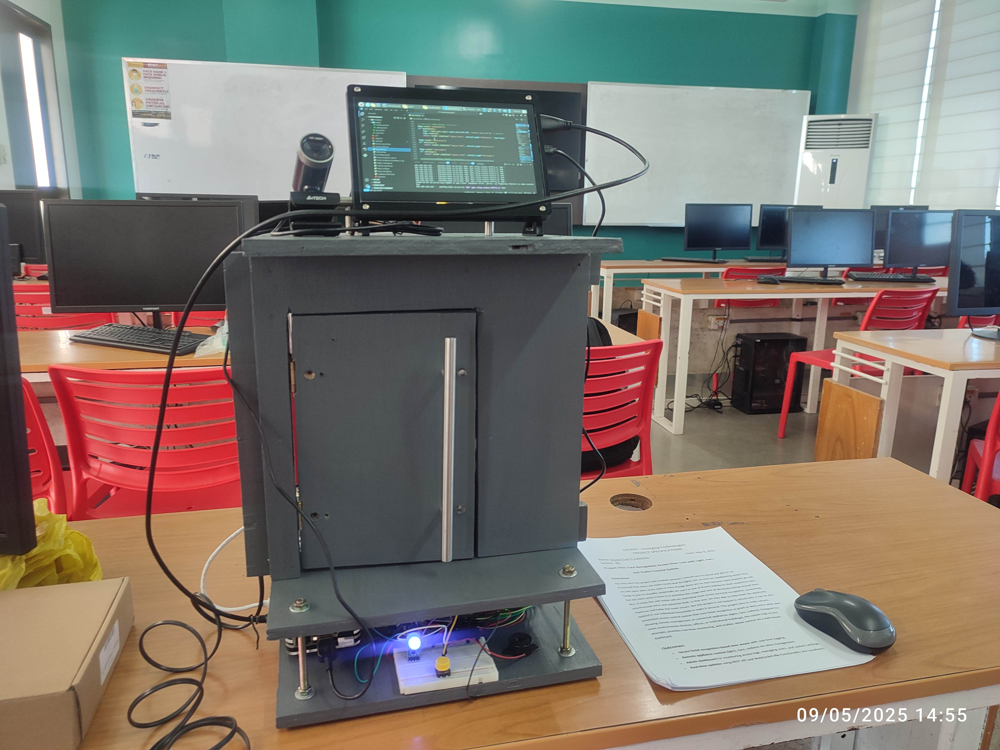

  

<h1 align="center">
  
</h1>

<!-- Fade-in animation keyframes -->

  <b>Computer Engineering • Developer • Embedded Systems</b> 
  <i>Exploring possibilities with web, build software and hardware projects!</i>

---

##  Technologies Used

#### Programming Languages
  
  
  
  
  
  
  
  
  

#### Full-Stack Frameworks
  
  
#### Frontend Technologies
  
  
  

#### Backend Technologies
  
  
  
  

#### Hosting Platforms
  
  
#### Authentication Services
  
  

#### Database Services
  
  
  
#### Storage Services
  

####  Microcontollers & Hardware

####  Design & Creative Tools

---

##  What I Do

- I keep learning, exploring and developing new things especially integrating hardware and software.

---

##  Featured Projects

###  **FaceRecognition Access Door Lock with Light, Fan, and Outlet Control System**
> A smart security system that uses facial recognition to control door access while automatically managing lights, fans, and outlets to optimize energy efficiency and prevent unauthorized use.

###  **SariXpress**
> SariXpress is an online sari-sari store built with Spring Tools Suite 4, offering a seamless shopping experience with product browsing, order management, and secure transactions. Powered by Spring Boot, it delivers a fast, scalable, and user-friendly platform for local retail.

###  **ACS AccessBright: Smart Door Lock & Lighting Control System**
> The AccessBright project is an embedded system that uses an ESP32 microcontroller, RFID card authentication, and dual-channel relays to control both a solenoid door lock and classroom lighting, with all access events and attendance data securely managed in a Firebase database. Administrators can monitor real-time logs and manage user access conveniently through a dedicated C# Windows Forms desktop application.

###  **CIT-U ETEEAP Portal**  
> [🔗 citu-eteeap.vercel.app](https://citu-eteeap.vercel.app)  
> Application platform for CIT-U's ETEEAP program with secure Clerk + Firebase integration and live form tracking.

### **Parking Hub**  
> [🔗 parking-hub.vercel.app](https://parking-hub.vercel.app)  
> Parking slot reservation system with real-time chat, push notifications, admin controls, and Firebase integration.

---

##  Currently Building

   
  

  

> Smart door lock using solenoid and a real-time web interface to log access.

---

## Connect With Me

  
  

---

  

